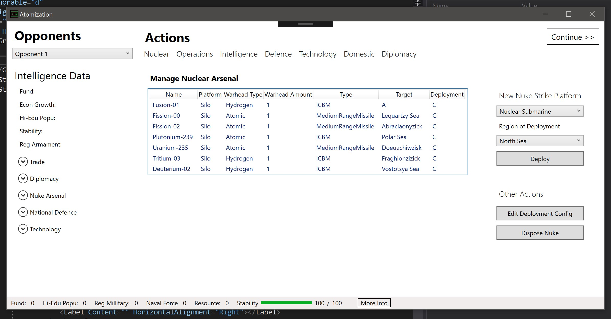

# Atomization

## Introduction

This is a game in which players can play as roles in a political gamming. In this game (simulation), players are able to gain advantages through manipulating their nuclear weapons and enact corresponding domestic and diplomatic policies. 

In this game (simulation), domestic stability is the key to excel. As soon as one of the opponents' stability reduces to zero, that player can no longer impose any influences on the game (game over). 

Commencing a total nuclear is a choice, but it is a risky move which could trigger unbearable nuclear revenge or MAD strikes. 

____

This game (simulator) is not adapted from any existed historical events. The developer (me) is not responsible for any action made by the players, nor its consequences. 

____
## Current Progress
